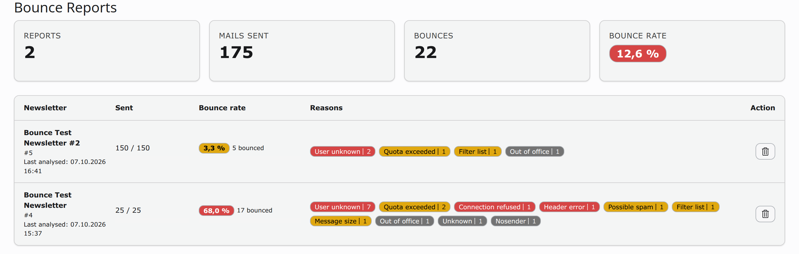
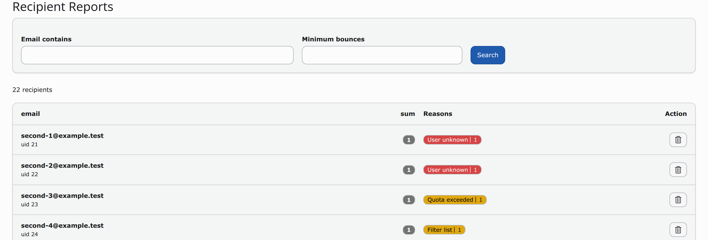

<!-- _class: title -->
# Newsletter mit TYPO3 erstellen und versenden


---

# Vorteile

* TYPO3 können und kennen wir! Auch die Redakteure!
* Inhalte aus TYPO3 verwenden, News nicht doppelt schreiben.


---

# Herausforderungen

* An- und Abmeldungen für eine Empfängerliste
* Templating für Tabellenlayout
* Versandtool
* Versandprobleme, als Spam eingestuft
* Bouncehandling
* Auswertungen, Statistiken

---

# Unsere Tools für Newsletter in TYPO3

* Für die An- und Abmeldung: `registeraddress`
  * als Ergänzung: `registeraddress_logger` für das Loggen des An- und Abmeldevorgangs
* Für Anlegen der Newsletter und den Versand: `cute_mailing`
  * dabei Nutzung der Extension `taskqueue` um die einzelnen Versandvorgänge nacheinander abzuarbeiten
* Für das Bouncehandling: `rsmbouncemailprocessor`
  * wertet das Bounce-Postfach aus und bereinigt die Empfängerliste

* Foundation für E-Mails, fertig einsetzbar in der Extension `email_template`
  * dabei Nutzung der Extension `html_mail_utility` (CSS Inliner, Inky Tags umschreiben)
    * PHP Erweiterung xsl notwendig

---

# Newsletter Templating bedeutet Tabellenlayout?

Wollen wir wirklich solchen Code schreiben?

```html

<table align="center" class="container">
  <tbody>
    <tr>
      <td>
        <table class="row">
          <tbody>
            <tr>
              <th class="small-12 large-12 columns first last">
                <table>
                  <tbody>
                    <tr>
                      <th>Put content in me!</th>
                    …
```

---

# Mit Inky können wir das so schreiben

```html
<container>
  <row>
    <columns>Put content in me!</columns>
  </row>
</container>
```

Das ist alles? Ja, diese 3 Angaben, 5 Zeilen Code werden in viele Zeilen HTML Code umgeschrieben.

---

<!-- _class: compact -->

# Das ist der erzeugte Code aus den 5 Zeilen vorher

```html
<table align="center" class="container">
  <tbody>
    <tr>
      <td>
        <table class="row">
          <tbody>
            <tr>
              <th class="small-12 large-12 columns first last">
                <table>
                  <tbody>
                    <tr>
                      <th>Put content in me!</th>
                      <th class="expander"></th>
                    </tr>
                  </tbody>
                </table>
              </th>
            </tr>
          </tbody>
        </table>
      </td>
    </tr>
  </tbody>
</table>
```

---

# Und was war jetzt mit CSS Inliner?

CSS muss für beste Kompatibilität direkt in die HTML Tags geschrieben werden.
Das macht auch niemand per Hand oder?

Foundation bietet dafür online einen Service an:
https://get.foundation/emails/inliner.html

Man könnte nun mit dem E-Mail Templates von Foundation
https://get.foundation/emails/email-templates.html

und dem CSS Inliner sich sein Template manuell zusammenbauen.

Das wollen wir nicht tun!

---

## Die TYPO3 Extension `email_template` bringt alles notwendige mit!

* ein PHP Ersatz für Inky
* ein CSS Inliner
* unterschiedliches Rendering für Ansicht im Browser und in der E-Mail
* ein fertiges Template was man sofort benutzen kann


---

# Newsletter anlegen und Versenden mit TYPO3

Für den Versand gibts es mittlerweile brauchbare Tools.

DirectMail war lange das Tool der Wahl für die meisten, ist aber in die Jahre gekommen.

* Mittlerweile ist mit `mail` ein direkter Nachfolger im TER und wird auch gepflegt.
* `luxletter` gibt es auch schon eine Weile.
* Das passte alles aber nicht genau für unsere Anforderungen, daher entwickelten wir CuteMailing.

---

# CuteMailing "nur" ein Versand Tool?

Ja genau, da ist es! Das war der Grund für uns im Februar 2022 eine solche Extension für TYPO3 zu bauen.
Wir wollten ein Tool was sich genau um diesen Prozess kümmert.

* `direct_mail` schied aus, da zu alt und nicht zukunftssicher aus unserer Sicht
  * `mail` gab es damals noch nicht
* `luxletter` war zu sehr auf fe_user fixiert, damals die MultiSite Konfiguration noch schwierig
* beide Tools machen noch einiges mehr, was wir gar nicht brauchen oder wollen

---

# Cute Mailing - Wie läuft das?

* Sys-Ordner für CuteMailing
* TypoScript Template für Newsletter anlegen
* Empfängerlisten anlegen (verschiedene Empfängerlistentypen durch zusätzliche Extension bereitgestellt)
* TYPO3 Seite für Versand anlegen
* Newsletterdatensatz anlegen mit den üblichen Daten (Empfänger, Subject, Absender)
* Mittels Scheduler oder manuell in der TaskQueue den Versand anstoßen
  * findet in 2 Schritten statt, 1. Newsletter entpacken, 2. einzelne Mails versenden

---

# Exotische Adressliste? Konnektoren!

* CuteMailing hat nur rudimentäre Empfängerliste (kommasepariert)
* Extensions erweitern dieses Möglichkeit: tt_address_ register address, etc.
* Damit maximale Freiheit

---

# Asynchrone Verarbeitung Taskqueue

+ Ebenfalls eigene Extension
* Newsletter Task
  * Rendert Newsletter
  * Erstellt Versandtask (Mailtask)
* Ersetzt marker (personalisierung)
* Verschickt mail

---

<p class="kicker">Bouncehandling</p>
<h2>Bounces automatisch auswerten</h2>
<hr class="rule" style="margin-bottom:30px">
<p class="lead" style="font-size:32px">Je mehr Bounces, desto schlechter die <strong>Absender-Reputation</strong> bei Gmail, Yahoo, T-Online &amp; Co. Die Extension <code>rsmbouncemailprocessor</code> räumt automatisch auf.</p>
<div class="steps" style="margin-top:34px">
<div class="step"><h3>Versand</h3><p>cute_mailing setzt <code>X-TYPO3RCPT</code>, <code>X-TYPO3NLUID</code>, <code>List-Unsubscribe</code> und den Return-Path.</p></div>
<div class="step"><h3>Postfach lesen</h3><p>Ein Scheduler-Task liest das Bounce-Postfach per IMAP oder POP3.</p></div>
<div class="step"><h3>Grund erkennen</h3><p>Regelwerk (per TypoScript erweiterbar): User unknown, Quota, Spam, Out of office … Zähler pro Newsletter und Empfänger.</p></div>
<div class="step"><h3>Aufräumen</h3><p>Grenzwert erreicht? Die Adresse wird gelöscht und protokolliert.</p></div>
</div>
<p class="lead" style="margin-top:30px;font-size:28px">Auch dabei: Abmeldungen über den <strong>List-Unsubscribe-Header</strong> der Mail-Apps werden verarbeitet.</p>

---

<p class="kicker">Bouncehandling · Backend</p>
<h2>Bounce Report pro Newsletter</h2>
<hr class="rule" style="margin-bottom:30px">
<div class="shot"></div>
<p class="caption">Versendete Mails, Bounce-Rate und Gründe pro Newsletter – inklusive Löschen des Reports</p>

---

<p class="kicker">Bouncehandling · Backend</p>
<h2>Recipient Report pro Empfänger</h2>
<hr class="rule" style="margin-bottom:30px">
<div class="shot"></div>
<p class="caption">Suche nach Adresse und Mindestanzahl der Bounces, Gründe je Empfänger, Löschen</p>

---

<p class="kicker">Bouncehandling · Konfiguration</p>
<h2>Einrichtung in drei Scheduler-Tasks</h2>
<hr class="rule">
<div class="cards c3 compact">
<div class="card"><div class="icon">1</div><h3>Analyze bounce mail</h3><p>Liest IMAP/POP3-Postfach, Anzahl Mails pro Lauf, Mails danach löschen. <strong>Alle 15–30 Minuten.</strong></p></div>
<div class="card"><div class="icon">2</div><h3>Process bounce mail</h3><p>Löscht Adressen, deren Grenzwert erreicht ist. <strong>Täglich.</strong></p></div>
<div class="card"><div class="icon">3</div><h3>Clean task queue</h3><p>Optional: alte Taskqueue-Einträge, Reports und Logs entfernen.</p></div>
</div>
<div class="cols" style="margin-top:44px">
<div>

```
# Page TSconfig des Newsletters
return_path = bounce@example.com
reply_to = bounce@example.com
listunsubscribe_enable = 1
listunsubscribe_email = bounce@example.com
```

</div>
<ul class="arrows small">
<li><strong>Grenzwerte</strong> pro Grund (<code>deletelimits</code>), <code>0</code> = nie löschen</li>
<li><strong>Delete-Log</strong> im Listenmodul</li>
<li>Voraussetzung: PHP <code>imap</code> und ein POP3/IMAP-Postfach</li>
</ul>
</div>

---

# Case study

* One of our clients sends a daily newsletter with currently about 60.000 recipients a day.
* Möglich mit TYPO3?
* CuteMailing kann das, (1000 mails ~ 30sec)(Auf Standard Hardware)

---


Links:

* https://extensions.typo3.org/extension/registeraddress
* https://packagist.org/packages/undkonsorten/registeraddress-logger
* https://github.com/undkonsorten/registeraddress_honeypot
* https://extensions.typo3.org/extension/cute_mailing
* https://github.com/undkonsorten/typo3-cute-mailing-registeraddress
* https://github.com/undkonsorten/typo3-cute-mailing-ttaddress
* https://extensions.typo3.org/extension/taskqueue
* https://github.com/undkonsorten/rsmbouncemailprocessor
* https://github.com/undkonsorten/email_template
* https://github.com/undkonsorten/html_mail_utility
* https://get.foundation/emails.html

---

<!-- _class: title -->

## Danke für eure Aufmerksamkeit.

### Fragen?


